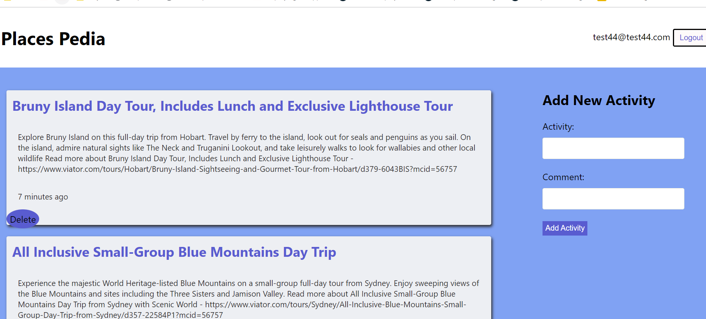

# PlacesPedia activities

🌍 Places Pedia 

## Table of Contents

  - [Usage](#usage)
  - [Technologies](#technologies)
  - [Tutorials](#tutorials)
  - [License](#license)
  - [Features](#features)
  
  ## Usage

 This application allows the user to save, information related to places of  interest. For mero people to Visit!!!

To be able to publish, the user may need to signup.
Once signed up  the user may have acees  to its owncommenta and activities.
A Visitor my just see a general list of all the available Activities that  in a furture they may join as the functionality of the app grows!!

1. List of published activities 

2. Current user adding Activities 

####   Technologies

* React for the front end.

* GraphQL with a Node.js and Express.js server.

* MongoDB and the Mongoose ODM for the database.

* Includes authentication (JWT).

* CSS Styling

* Several packages for front and backend

####   Tutorials
- stack overflow
- w3Schools
- labstack
- youtube

  ## License

  This application is licensed under Creative Commons

  ## Features
  - Add Activities 👪
  - List Activities 🌉
  
  

  - - -
© 2022 Nancy S. All Rights Reserved.

